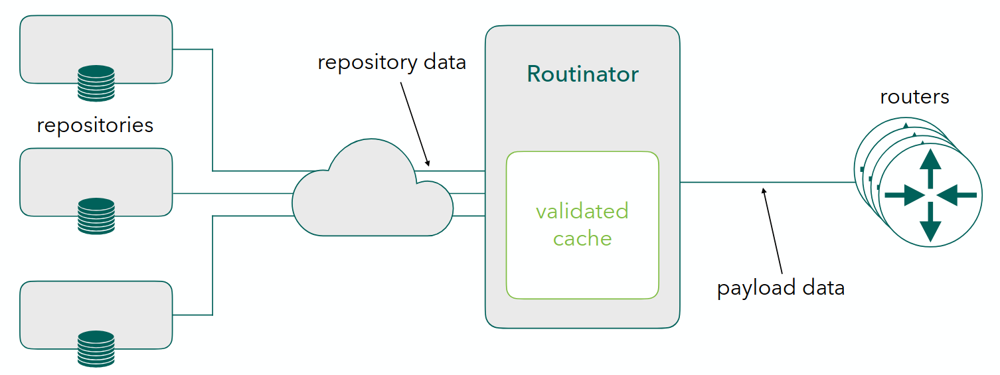

##############
 Threat Model
##############

Routinator is an RPKI (Resource Public Key Infrastructure) relying party
client that retrieves data from the various RPKI repositories, checks its
validity, and produces a validated payload for consumption by BGP (Border
Gateway Protocol) routers.

BGP routers are the backbone of the Internet. They use protocols that allow
your packet to reach its destination. This is done by networks announcing to
neighbouring networks what destination can be reached via them. Traditionally
this was done on good faith -- the RPKI adds a way to partially verify these
statements.

The data Routinator retrieves from the repositories, as well as the
repositories themselves and their locations, are untrusted. Trust is
established by cryptographic signatures that can only be made by resource
holders. Signatures are validated, contents are checked according to the
schema, and data is checked against the constraints in the certificate.

There are two kinds of data:

-  **Repository data** is the data retrieved from public repositories on the
   open Internet by Routinator. This data is unvalidated and untrusted. Trust is
   established by verifying the signatures.

-  Validated **payload data** is the data Routinator parsed from the
   repositories and is sent to the routers. This data is validated and should
   be trustworthy.

We have created a threat model for Routinator [#f1]_, where we outline the
assumptions of the system that Routinator runs on, and the guarantees
Routinator provides given that those assumptions are met. The model concludes
with a description of threats posed by adversaries with different
capabilities.

*********************************
 Goals, Assumptions & Guarantees
*********************************

Routinator should:

-  retrieve repository data from repositories in a reasonable time,

-  parse retrieved repository data correctly and in a reasonable time,

-  not let one repository impact the outcome of another repository, unless
   that repository is a child of the former repository,

-  be able to provide complete, non-malformed, validated payloads to routers
   for data thus retrieved, and:

   -  run correctly even if the input data is malformed,
   -  only include validated and correct data in the data sent to routers,
   -  reject invalid data without impacting availability and integrity of
      valid data (that is not dependent on the rejected data),

-  keep resource (memory, file system, etc.) consumption within reasonable
   bounds.

General assumptions:

-  The user uses an authentic copy of Routinator.
-  Routinator runs unpriviliged and sandboxed using the provided `systemd .service file <https://github.com/NLnetLabs/routinator/blob/main/pkg/common/routinator-systemd-257.routinator.service>`_
   (or an equivalent you provide).
-  Routinator is operated in a network location that does not provide access to
   internal HTTP or rsync resources.
-  An adversary does not have administrative control over the host system
   Routinator runs on.
-  An adversary does not have write-access to Routinator’s cache directories.
-  The user uses trusted TALs, and the TALs enabled by default are trusted.
-  Advances in cryptoanalytic attacks against the cryptographic primitives
   used by the RPKI have not occurred.
-  Published repository data is authentic, i.e., resource holders maintain
   confidentiality of the private key used to sign statements in the RPKI.

Routinator guarantees the following:

-  Unsigned or incorrectly signed objects in the RPKI will not end up in the
   validated RPKI payloads provided to routers.

-  For a repository that is reachable, when repository data set up in a
   reasonable and best practice compliant manner, modifications in the RPKI
   will be processed by Routinator in a reasonable time.

*******************************
 What an adversary can achieve
*******************************

With the aforementioned assumptions and guarantees in mind, the following are
examples of things an adversary with various capabilities can achieve.

An adversary with the ability to publish repository data could:

-  craft publication point URIs to make Routinator perform HTTP GET or rsync
   requests to internal resources, circumventing access controls, with the
   exception of host names that Routinator considers dubious (see
   :option:`--allow-dubious-hosts`).

An adversary with network access on-path between Routinator and a repository
could:

-  block access to the repository or degrade throughput of access to
   repository data,

-  downgrade the transport used for repository access from RRDP (which
   provides confidentiality and integrity at the transport level) to rsync
   (which does not). This behaviour was decided by the community. After such a
   downgrade, the adversary can:

   -  inject objects, withhold objects and manipulate objects at the transport
      level, leading to rejection by Routinator of otherwise valid repository
      data,

   -  replay old objects, suppressing updates to older objects for their
      validity period,

-  infer the configuration of Routinator with respect to the configured TALs
   and timeouts and other network-related settings.

***********************************
 Example violations of assumptions
***********************************

The following are examples of the implications associated with violating some
of the aforementioned assumptions.

An adversary who compromises the host system could:

-  stop, modify, and manipulate Routinator,
-  modify the Routinator configuration,
-  add, modify or remove trusted TALs, thus allowing for injection or removal
   of valid RPKI payloads,
-  bypass Routinator and provide incorrect data as validated RPKI payload to
   routers.

An adversary who compromises a resource holder's key material could:

-  sign valid statements that will then be successfully validated and included
   in the payload data to routers. This includes the ability to hijack a
   prefix or invalidate a genuine announcement.

.. rubric:: Footnotes

.. [#f1]

   Based on the `threat model for restic
   <https://github.com/restic/restic/blob/master/doc/design.rst#threat-model>`_.
