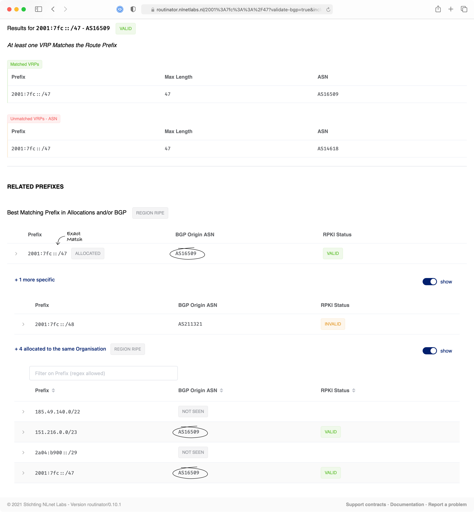

User Interface
==============

Routinator's HTTP service offers a web based user interface on the ``/ui``
path. In addition to displaying detailed statistics from the last validation
run Routinator has performed, as well as HTTP and RTR connection metrics, the
most prominent functionality is the Prefix Check.

.. figure:: img/routinator-ui-prefix-check.png
    :align: center
    :width: 100%
    :alt: Routinator user interface

    The Routinator Prefix Check

By default, you only need to provide an IP address or prefix. When clicking
:guilabel:`Validate`, Routinator will look up from which Autonomous System
the closest matching prefix is announced in BGP and perform RPKI validation.
Alternatively, you can manually provide an ASN. 

The returned RPKI validity state will be *Valid*, *Invalid* or *NotFound* and
is based on the current set of Validated ROA Payloads (VRPs) in the cache.
Routinator will provide an overview of all VRPs that led to the result, along
with the reason for the outcome.

Routinator doesn't just retrieve the ASN for a specific prefix, but it also
fetches related information. In addition to validating the longest matching
prefix (or exact match if this is what you selected), details can be provided
on less specific and more specific announcements seen in BGP, as well as
other resources allocated to the same organisation.

    Prefixes related to your query

Routinator does not perform the BGP and allocation lookups itself, but relies
on the open-source `roto-api <https://github.com/NLnetLabs/roto-api>`_
service, developed and hosted by NLnet Labs at `bgp-api.net
<https://rest.bgp-api.net/api/v1/>`_. The service uses these data sources:

  - BGP information based on `RISWhois <https://www.ris.ripe.net/dumps/>`_
    data, which is part of the RIPE NCC's `Routing Information Service
    <https://ris.ripe.net/>`_ (RIS). This data set is currently updated every
    8 hours.
  - Resource allocations retrieved from `statistics
    <https://www.nro.net/about/rirs/statistics/>`_ hosted by the five
    Regional Internet Registries. These are updated daily.

You may wish to host the UI on a different machine than the machine Routinator 
runs on, or on a path that is different from ``/ui``. See our documentation for 
:ref:`building the UI <building:Building the UI>` on how to do that.

.. versionadded:: 0.8.3
.. versionchanged:: 0.10.0
   The Prefix Check
