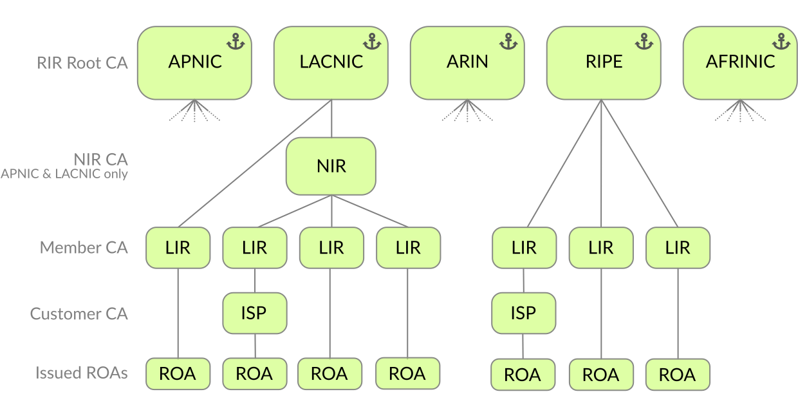

.. _doc_routinator_data_processing:

Data Processing
===============

Fetching
--------

.. versionadded:: 0.9
   Fallback from RRDP to rsync with :option:`--rrdp-fallback-time`

There are two protocols in use to transport RPKI data: rsync and the RPKI
Repository Delta Protocol (RRDP), which relies on HTTPS. RRDP was designed to be
the successor to rsync in the RPKI. As almost all RPKI repositories currently
support both protocols, Routinator will prefer RRDP if available. 

In the RPKI, the certificate hierarchy follows the same structure as the
Internet number resource allocation hierarchy. Routinator starts traversing the
tree by connecting to the trust anchors of the Regional Internet Registries
(RIRs). Along the way Routinator will find several pointers to child publication
points, such as the ones operated by National Internet Registries (NIRs), Local
Internet Registries (LIRs) and organisations running delegated RPKI. Each
pointer explicitly states if RRDP is offered in addition to rsync.

    The RPKI hierarchy

As a precaution, Routinator will not accept rsync and HTTPS URIs from RPKI
repositories with dubious hostnames. In particular, it will reject the name
*localhost*, URIs that consist of IP addresses, and hostnames that contain an
explicit port. You can change this behaviour with the
:option:`--allow-dubious-hosts` option.

RRDP Fallback
"""""""""""""

If an RRDP endpoint is unavailable but it has worked in the past, Routinator
will assume this is a transient problem. It will retry using RRDP for up to 60
minutes since the last successful update, during which it will rely on the
locally cached data for this repository. After this time, Routinator will try to
use rsync to fetch the data instead. To spread out load on the rsync server, the
exact moment fallback happens is picked randomly between the refresh time and
the :option:`--rrdp-fallback-time` value. If rsync communication is
unsuccessful too, the local cache is used until the objects go stale and
ultimately expire. 

Update Interval
"""""""""""""""

Routinator will fetch new RPKI data ten minutes after the last successful update
has finished. The interval can be changed using the :option:`--refresh` option.
It is possible that it takes very long to update a repository due to
temporary network problems. To ensure a slow repository doesn't stop the entire
update process from completing, Routinator has a timeout for stalled
connections. For RRDP, this timeout is implemented as an HTTP request timeout.
For rsync, the timeout is around the spawned rsync process. The default is five
minutes for both and can be changed via the :option:`--rsync-timeout` and
:option:`--rrdp-timeout` options.

Validating
----------

The validation process determines if all certificates, Route Origin Attestations
(ROAs) and other signed objects that may appear in the RPKI have the correct
signatures. It will also verify if the hashes are correct, no objects have
expired and the entire data set is complete. If any of the objects do not pass
these checks, the data will be discarded.

Currently, only certificates (.cer), certificate revocation lists (.crl),
manifests (.mft), ROAs (.roa), and Ghostbuster Records (.gbr) are allowed to
appear the RPKI. If another type of object is encountered Routinator will *warn*
by default, but this can be changed with the :option:`--unknown-objects` option. 

Note that even if unknown objects are accepted, they must appear in the manifest
and the hash over their content must match the one given in the manifest. If the
hash does not match, the Certificate Authority (CA) and all its objects are
still rejected.

Stale Objects
"""""""""""""

During the validation process, Routinator may encounter objects that are
*stale*. In RPKI, manifests and :abbr:`CRLs (Certificate Revocation Lists)` can
be stale if the time given in their ``next-update`` field is in the past,
indicating that an update to the object was scheduled but didn't happen. This
can be because of an operational issue at the issuer or an attacker trying to
replay old objects. 

Ongoing standards efforts and operational experiences suggest that stale objects
should be rejected, which is the default policy set by the :option:`--stale`
option since Routinator 0.8.0. As a result, all material published by the CA
issuing this manifest and CRL is considered invalid, including all material of
any child CA.

ROAs and VRPs
"""""""""""""

ROAs are *cryptographic* objects that contain a statement authorising a *single*
Autonomous System Number (ASN) to originate *one or more* IP prefixes, along
with their maximum prefix length. ROAs can only be created by the legitimate
holder of the IP prefixes contained within it, but they can authorise any ASN.

If the ROA passes validation, Routinator will produce one or more *plain text*
validated ROA payloads (VRPs) for each ROA, depending on how many IP prefixes
are contained within it. Each VRP is a tuple of an ASN, a single prefix and its
maximum prefix length. The complete collection of VRPs can be expressed in
formats such as CSV or JSON, or exposed via the RPKI-to-Router (RTR) protocol so
that they can be compared to all BGP origins seen by your routers. For each
route origin it can be determined if they are RPKI *"Valid"*, *"Invalid"* or
*"NotFound"*.

.. _doc_routinator_unsafe_vrps:

Unsafe VRPs
"""""""""""

If the address prefix of a VRP overlaps with any resources assigned to a CA that
has been rejected because if failed to validate completely, the VRP is said to
be *unsafe* since using it may lead to legitimate routes being flagged as RPKI
Invalid.

Routinator has an :option:`--unsafe-vrps` option that specifies how to deal with
these types of VRPs. Currently, the default policy is *warn* in order to gain
operational experience with the frequency and impact of unsafe VRPs. This
default may change in future version.

Storing
-------

.. versionadded:: 0.9
   The *store* and the :option:`--fresh` option

To be resistant against accidental or malicious errors in the data published by
repositories, Routinator retains two separate data sets: one that keeps the data
of all publication points as it was received from their remote repository, and
another – which we call the *store* – keeps the most recent data of a given RPKI
publication point that was found to be correctly published. 

Data is only transferred into the store if a manifest was found to be valid and
if all files mentioned on the manifest are present and have the correct hash.
Otherwise the data for the publication point already present in the store will
be used for validation.

If you ever want or need to clear all stored data, you can use the
:option:`--fresh` option. This will be like starting Routinator for the very
first time:

.. code-block:: text

    routinator --fresh vrps
