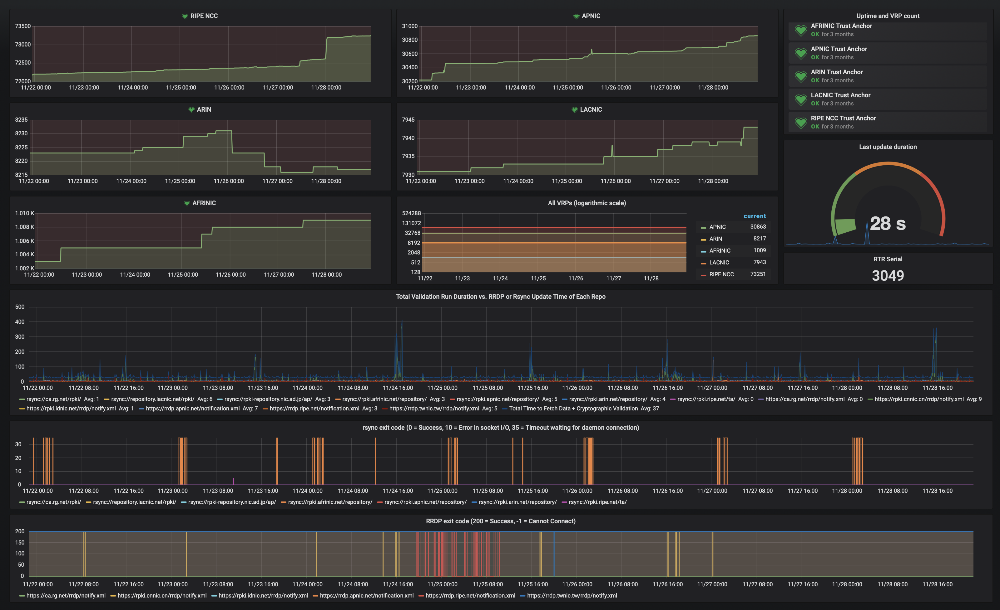

.. _doc_routinator_monitoring:

Monitoring
==========

The HTTP server in Routinator provides endpoints for monitoring the application.
To launch Routinator in server mode on 192.0.2.13 with RTR running on port 3323
and HTTP on 9556, use the following command:

.. code-block:: text

   routinator server --rtr 192.0.2.13:3323 --http 192.0.2.13:9556

The HTTP service has these monitoring endpoints on the following paths:

:command:`/version`
     Returns the version of the Routinator instance

:command:`/metrics`
     Exposes time series data specifically for
     `Prometheus <https://prometheus.io/>`_, for which `dedicated port 9556
     <https://github.com/prometheus/prometheus/wiki/Default-port-allocations>`_
     is reserved.

:command:`/status`
     Returns a subset of the information from the :command:`/metrics` endpoint
     in a more concise format

Metrics
-------

Update metrics
  - When the last update started and finished
  - The total duration of the last update
  - The retrieval duration and `exit code <https://lxadm.com/Rsync_exit_codes>`_ for each rsync publication point
  - The retrieval duration and `HTTP status code <https://en.wikipedia.org/wiki/List_of_HTTP_status_codes>`_ for each RRDP publication point 

Object metrics
  - For each crypotographic object that can appear in the RPKI, the number of valid, invalid and stale items per trust anchor and repository
  - The number of validated ROA payloads (VRPs) per Trust Anchor and repository
  - The number of VRPs added and excluded locally

RTR server
  - The current RTR serial number
  - The current number of RTR connections
  - The total amount of bytes sent and received over the RTR connection
  - Metrics for each RTR client is available if the :option:`--rtr-client-metrics` option is provided
  
HTTP server
  - The current number of HTTP connections
  - The total amount of bytes sent and received over the HTTP connection
  - The number of HTTP requests

.. _doc_routinator_monitoring_grafana:

Grafana
-------

Using the Prometheus endpoint it's possible to build a detailed dashboard using
for example `Grafana <https://grafana.com>`_. We provide a `template
<https://grafana.com/grafana/dashboards/11922>`_ to get started.

    A sample Grafana dashboard
