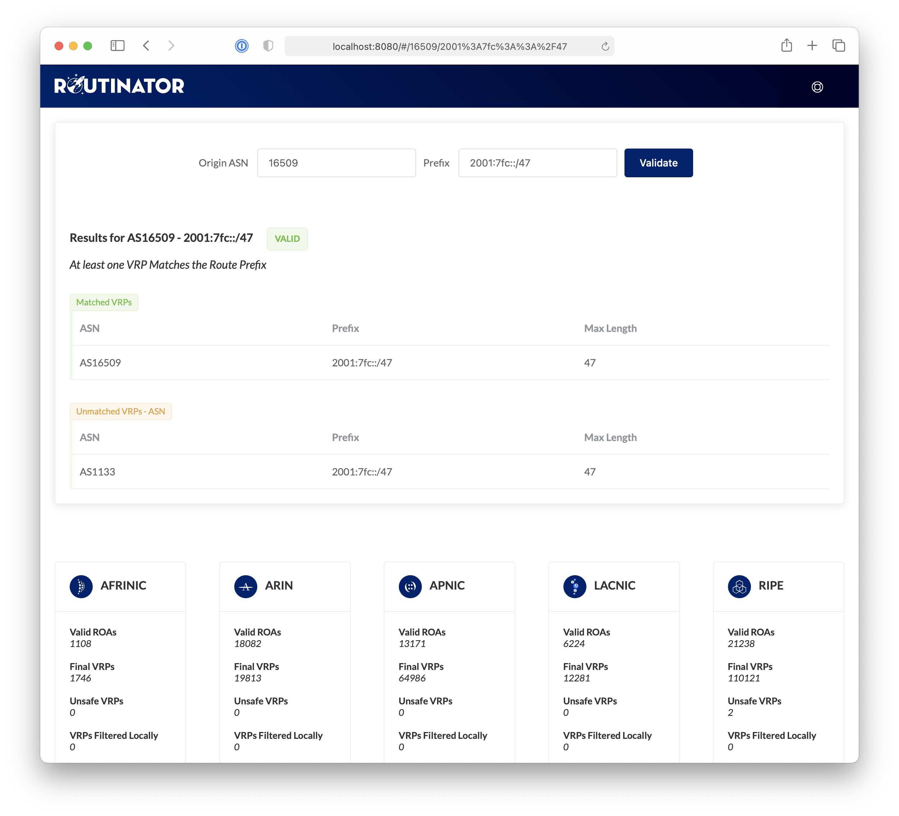

.. _doc_routinator_ui:

User Interface
==============

Routinator offers a web based user interface. In order to start the HTTP
server at 192.0.2.13 and 2001:0DB8::13 on port 8323, run this command:

.. code-block:: text

   routinator server --http 192.0.2.13:8323 --http [2001:0DB8::13]:8323

The application will stay attached to your terminal unless you provide the
:option:`--detach` option. After the first validation run has completed, the
user interface from the example above will be available at 
http://192.0.2.13:8323/.

    The Routinator user interface

The web interface provides several functions. It displays detailed statistics
from the last validation run Routinator has performed, as well as HTTP and RTR
connection metrics. You can also use the UI to verify the RPKI origin validation
status of an AS Number and IP Prefix combination. 

Verifying the validation status can be done by entering an existing BGP
announcement or an ASN and prefix of your choice, for example for an
announcement you're planning to do. The returned RPKI validity state will be
*Valid*, *Invalid* or *NotFound* and is based on the current set of Validated
ROA Payloads (VRPs) in the cache. Routinator will provide an overview of all
VRPs that led to the result, along with the reason for the outcome.

.. _doc_routinator_reverse_proxy:

Reverse Proxy with NGINX
------------------------

Routinator's built-in HTTP server is intended to run on your internal network
and doesn't offer HTTPS natively. If this is a requirement, you can for example
run Routinator behind an `NGINX <https://www.nginx.com>`_  reverse proxy. 

For convenience, all the files and folders for the user interface are hosted
under the ``/ui`` path. This allows you to just expose the user interface and
not any of the other paths, such as those serving the various VRP output
formats.

To only make the user interface available through a reverse proxy, this is what
your NGINX configuration needs at a minimum when running it on the same server
as Routinator runs on, using port 8323:

.. code-block:: text

    location = / {
      proxy_pass http://127.0.0.1:8323/;
    }
    location /ui {
      proxy_pass http://127.0.0.1:8323/ui;
    }
    location /api {
      proxy_pass http://127.0.0.1:8323/api;
    } 